# Goal: 

Generate the CHM format document from official PostgreSQL or Postgres-X2 documentation.

This tools generate the "hhk" and "hhc" file for chm.

# Usage:

get gen_pgdoc_chm source from github:

```
git clone https://github.com/osdba/gen_pgdoc_chm.git
```

copy html document from PostgreSQL source code, examples:

```
cd gen_pgdoc_chm
cp ~/Downloads/postgresql-9.4.2/doc/src/sgml/html ./
```

After finish the above operation, you can see the following directory structure：

```
osdba-mac:gen_pgdoc_chm osdba$ ls -l
total 32
-rw-r--r--@   1 osdba  osdba      0 Dec 31 10:14 README.md
-rwxr-xr-x@   1 osdba  osdba   4344 Dec 31 09:43 gen_chm_prj.py
drwxrwxr-x  971 osdba  osdba  33014 Dec 31 09:20 html
-rwxr-xr-x@   1 osdba  osdba   6391 Aug 11  2013 pgdocget.py
```

Html directory of the above is copied from the official PostgreSQL html format document in source code.

Generate "hhc" and "hhk" file:

```
osdba-mac:gen_pgdoc_chm osdba$ ./gen_chm_prj.py -n Postgres-X2
Begin generate Postgres-X2.hhc ...................................................
..................................................................................
..................................................................................
..................................................................................
...
...
...Generate %s finished.
Begin generate Postgres-X2.hhk ...
===== WARN: html/LEGALNOTICE.html no soup.title
Generate Postgres-X2.hhk finished.
osdba-mac:gen_pgdoc_chm osdba$ ./gen_chm_prj.py -n Postgres-X2
Begin generate Postgres-X2.hhc ...................................................
..................................................................................
..................................................................................
...
...
.....................................................Generate %s finished.
Begin generate Postgres-X2.hhk ...
===== WARN: html/LEGALNOTICE.html no soup.title
Finished.

osdba-mac:gen_pgdoc_chm osdba$ ls -l
total 600
-rw-r--r--    1 osdba  osdba  147471 Dec 31 11:34 Postgres-X2.hhc
-rw-r--r--    1 osdba  osdba  138369 Dec 31 11:34 Postgres-X2.hhk
-rw-r--r--@   1 osdba  osdba       0 Dec 31 10:14 README.md
-rwxr-xr-x    1 osdba  osdba    5518 Dec 31 11:33 gen_chm_prj.py
drwxrwxr-x  971 osdba  osdba   33014 Dec 31 09:20 html
-rwxr-xr-x@   1 osdba  osdba    6391 Aug 11  2013 pgdocget.py
```

You can see "Postgres-X2.hhc" and "Postgres-X2.hhk"  have been generated.


Copy "Postgres-X2.hhc" and  "Postgres-X2.hhk" and html directory to a windows machine, then run "HTML Help Workshop"(if you not install "HTML Help Workshop", installed it):


Clike "new" menu in "HTML Help Workshop":

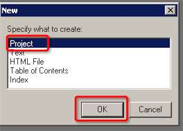

Next:


Next:

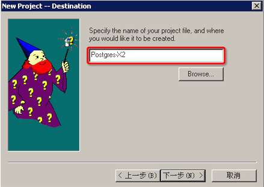

Next:

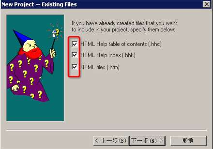

Next:

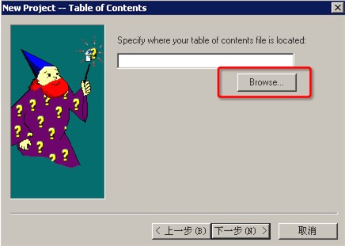

Next:

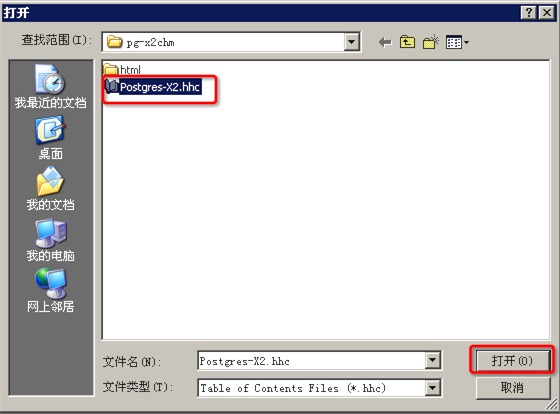

Next:

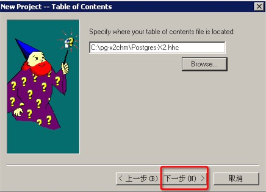

Next:

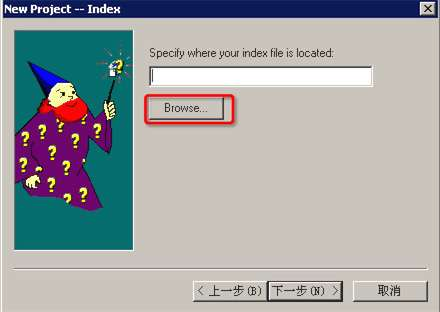

Next:

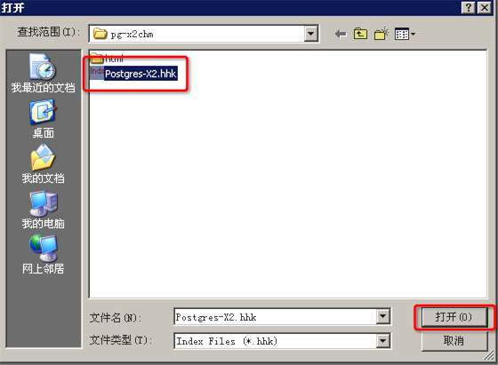

Next:

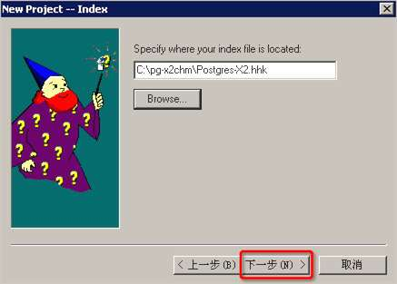

Next:


Next:

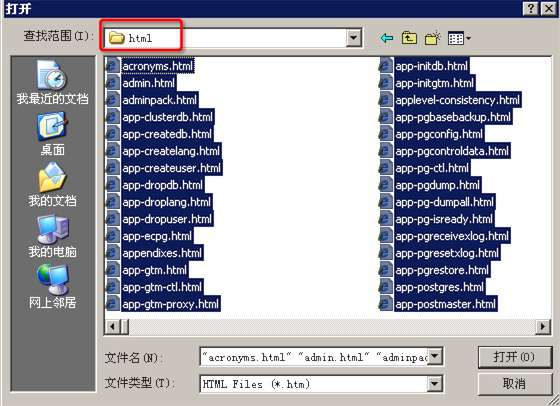

Next:

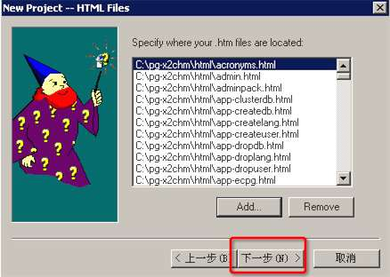

Next:

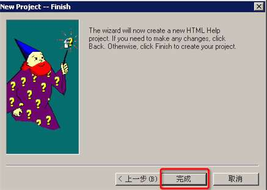

Next:

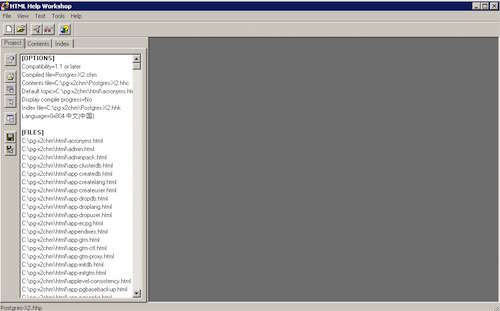

Next:

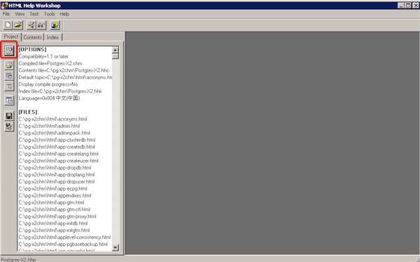

Next:

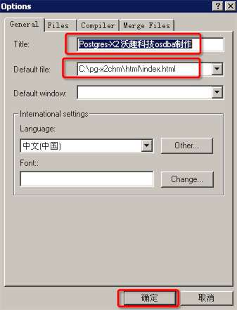

Next:

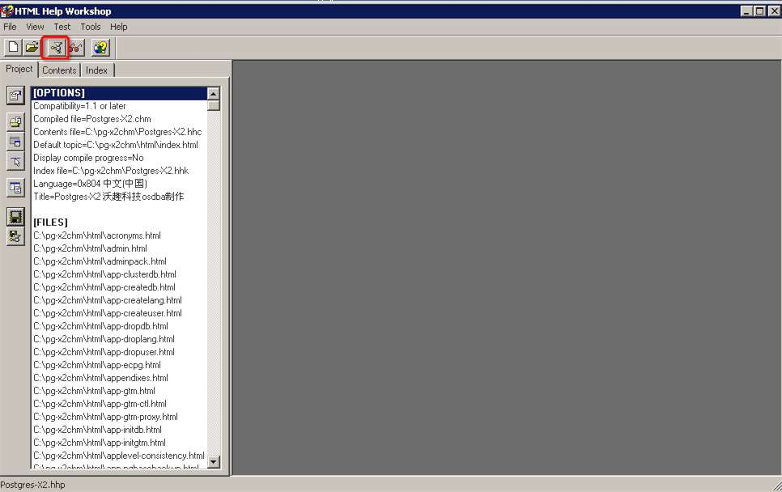

Next:

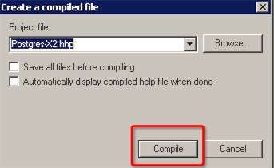

Next:


Finally, you can see the generated chm file "Postgres-X2.chm":

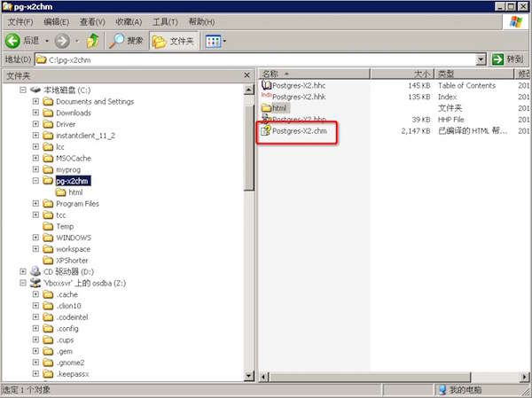

